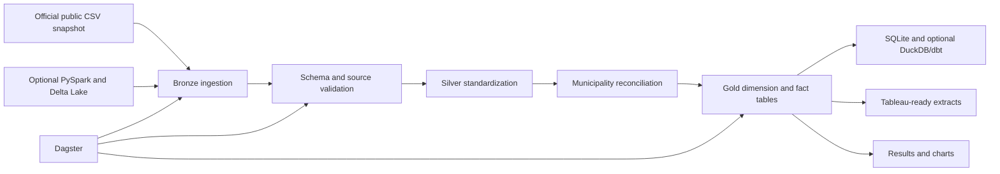

# Alberta Well and Production Data Lakehouse

An end-to-end data engineering portfolio project built with official, freely available Alberta energy data. The default pipeline loads a versioned public-data snapshot, validates it, standardizes municipality identifiers, builds bronze, silver, and gold datasets, creates a queryable analytics database, produces Tableau-ready extracts, and generates documented analytical results.

The repository runs immediately after dependency installation. No paid dataset, API key, cloud account, or database server is required.

## Actual output included in this repository

The committed snapshot contains 33 official public-data records covering 18 Alberta municipalities:

| Dataset | Reference year | Included records |
|---|---:|---:|
| Oil production by municipality | 2025 | 12 |
| Natural gas production by municipality | 2025 | 10 |
| Well count by municipality | 2024 | 11 |

The completed pipeline produced:

- 50.38 million m³ of oil represented in the included snapshot
- 2.65 billion m³ of natural gas represented in the included snapshot
- 1,826 reported wells represented in the included well-count snapshot
- 18 automated quality checks with 0 failures
- 3 bronze tables, 3 silver tables, and 3 gold analytics tables
- A SQLite analytics database, Tableau-ready extracts, ranked result tables, four charts, and a browser dashboard

These are totals for the municipalities curated into this repository, not province-wide totals.

Key findings from the included snapshot:

- Bonnyville No. 87 has the highest oil production in the snapshot at 32.5 million m³.
- Rocky View County has the highest natural gas production in the snapshot at 1.7 billion m³.
- Greenview No. 16 has the highest reported well count in the snapshot at 571 wells.
- The strongest production momentum among the included municipalities is in Rocky View County.

The full generated analysis is available in [`results/ANALYSIS.md`](results/ANALYSIS.md).

## Data sources

### Bundled official snapshot

The data in `data/source_snapshot/` is a curated snapshot from the Government of Alberta Regional Dashboard under the Open Government Licence - Alberta. Each record retains:

- The municipality and reference year
- The published value and unit
- Year-over-year and five-year percentage changes
- The row-level source page
- Source update and snapshot retrieval dates
- Licence and source attribution

The snapshot is committed so the project can be cloned, installed, executed, and reviewed without relying on an external service during evaluation.

### Full free upstream sources supported

The project also includes download adapters for larger official sources:

- **AER ST37 List of Wells in Alberta:** monthly well lifecycle, licence, location, production-string, and geometry information
- **Petrinex Alberta Public Data:** well infrastructure, well licences, facility infrastructure, facility operator history, well-to-facility links, and conventional volumetric data
- **Government of Alberta Regional Dashboard:** municipality oil production, natural gas production, and well-count exports

Large upstream files are downloaded to `data/external/` and are excluded from Git. This keeps the repository reviewable and avoids redistributing large source archives. See [`docs/public_data_sources.md`](docs/public_data_sources.md).

## Architecture



## Data layers

| Layer | Purpose | Main outputs |
|---|---|---|
| Source snapshot | Preserve auditable public values and source metadata | Three versioned official CSV files and a manifest |
| Bronze | Append ingestion timestamp, source filename, and record hash | `lakehouse/bronze/public_snapshot/` |
| Silver | Standardize types, municipality keys, dates, metrics, and duplicates | `lakehouse/silver/public_snapshot/` |
| Gold | Build analytics-ready dimension, fact, and municipality summary tables | `warehouse/gold/` |
| Serving | Support SQL analysis, Tableau, and portfolio review | SQLite database, Tableau CSVs, dashboard, results, and charts |

## Technology stack

- Python and Pandas for the default reproducible pipeline
- PySpark and Delta Lake for the optional lakehouse execution path
- SQL, SQLite, DuckDB, and dbt for analytics modelling
- Dagster for asset orchestration and scheduling
- Tableau-ready CSV extracts and a browser dashboard
- Pytest, Ruff, GitHub Actions, Docker, and environment validation

## Quick start

Python 3.11 is recommended. Java 17 or later is required only for the optional PySpark and Delta Lake path.

### Linux, macOS, or WSL2

```bash
python -m venv .venv
source .venv/bin/activate
python -m pip install --upgrade pip setuptools wheel
python -m pip install -r requirements.txt
make public-data
```

### Windows PowerShell

```powershell
python -m venv .venv
.\.venv\Scripts\Activate.ps1
python -m pip install --upgrade pip setuptools wheel
python -m pip install -r requirements.txt
python scripts/build_public_data_project.py
```

The pipeline is deterministic and can be rerun safely. It recreates the output database and refreshes generated result files.

## Review the output

Open the local dashboard:

```text
tableau/dashboard_preview.html
```

Review the generated results:

```text
results/ANALYSIS.md
results/summary_metrics.json
results/pipeline_run_manifest.json
results/top_oil_producers.csv
results/top_gas_producers.csv
results/top_well_activity.csv
results/data_quality_report.csv
results/charts/
```

Query the analytics database:

```bash
python - <<'PY'
import sqlite3

with sqlite3.connect("warehouse/alberta_energy_analytics.sqlite") as connection:
    rows = connection.execute(
        """
        SELECT municipality, oil_m3_2025, gas_m3_2025, well_count_2024
        FROM mart_municipality_energy_summary
        ORDER BY energy_activity_score DESC
        LIMIT 10
        """
    ).fetchall()

for row in rows:
    print(row)
PY
```

## Generated tables

### `dim_municipality`

One deterministic municipality key and name per municipality.

### `fct_energy_activity`

A normalized fact table containing metric, year, value, unit, and published growth rates.

### `mart_municipality_energy_summary`

A cross-source analytics mart containing:

- 2025 oil and natural gas production
- 2024 well count
- Published year-over-year and five-year change rates
- Clearly labelled prior-period estimates derived from the published percentages
- Oil and gas volume per reported well for indicative comparison
- Production momentum classification
- A reproducible 0–100 energy activity score

The exact field definitions are documented in [`docs/public_data_dictionary.md`](docs/public_data_dictionary.md).

## Data-quality controls

The pipeline fails before gold-table creation when a blocking quality check fails. Current checks cover:

- Required fields and source metadata
- Duplicate municipality, year, and metric combinations
- Non-negative production and well-count values
- Valid reference-year ranges
- HTTPS source URLs
- Presence of licence information

The included snapshot passes all 18 checks.

## Optional PySpark and Delta Lake pipeline

Run the bundled official data through Delta Lake:

```bash
make spark-public
```

This path:

1. Reads the same official source files with an explicit PySpark schema.
2. Adds source and ingestion metadata.
3. Performs incremental Delta merge operations using municipality, year, and metric keys.
4. Writes standardized silver Delta data.
5. Exports the silver table to Parquet for downstream SQL modelling.

Java must be available on `PATH`. Delta Lake may download its matching JAR files during the first run.

## dbt and DuckDB models

Build and test the included dbt project:

```bash
make dbt
```

The dbt project creates:

- `stg_public_energy_activity`
- `mart_metric_summary`
- `mart_municipality_rankings`

The dbt tests verify required fields and accepted metric values.

## Dagster orchestration

Start Dagster:

```bash
dagster dev -m orchestration.definitions
```

Open the local URL shown in the terminal. The asset graph contains:

- Official public snapshot
- Data-quality validation
- Municipality energy marts

A daily schedule is configured for 6:00 AM in the `America/Edmonton` timezone.

## Refresh free source files

Examples:

```bash
python scripts/download_free_sources.py regional-oil
python scripts/download_free_sources.py regional-gas
python scripts/download_free_sources.py regional-wells
python scripts/download_free_sources.py aer-st37
python scripts/download_free_sources.py aer-well-feature-sample --limit 2000
python scripts/download_free_sources.py petrinex-well-infrastructure
python scripts/download_free_sources.py petrinex-volumetric --month 2026-05
```

Downloaded files are placed in `data/external/`. Upstream providers can change filenames, response packaging, or endpoint behaviour, so downloaded files should be inspected before they replace the versioned snapshot.

## Tests and validation

```bash
make test
make lint
python scripts/check_environment.py
```

The test suite verifies known official snapshot values, data-quality results, municipality joins, and gold-table outputs.

## Repository structure

```text
data/source_snapshot/          Versioned official public-data snapshot
data/external/                 Optional full source downloads, excluded from Git
src/alberta_well_lakehouse/    Pipeline, quality, gold modelling, and Spark code
lakehouse/bronze/              Ingestion-preserving outputs
lakehouse/silver/              Standardized and validated outputs
warehouse/gold/                Analytics-ready CSV and optional Parquet tables
warehouse/*.sqlite             Queryable local analytics database
dbt/alberta_well_analytics/    dbt staging, summary, and ranking models
orchestration/                 Dagster assets and schedule
scripts/                       Build, download, Spark, and environment commands
tableau/                       Tableau extracts and browser dashboard
results/                       Actual metrics, ranked outputs, analysis, and charts
tests/                         Automated validation
```

## Interpretation limits

- The committed data is a curated official snapshot, not the complete provincial population.
- Oil and gas values use 2025 data, while well counts use 2024 data.
- Per-well measures are comparative analytics, not engineering productivity calculations.
- Columns ending in `_estimated` are mathematically derived from published percentage changes and are not independent observations.
- AER and Petrinex full extracts should be processed locally with source attribution and in accordance with their current terms.
